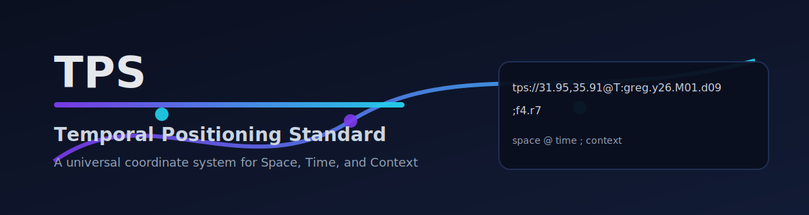

# TPS — Temporal Positioning Standard



> **A universal coordinate system for Space, Time, and Context.**

TPS defines a deterministic way to represent **when** something happened, **where** it happened, and **under which calendar**, using a single, machine-readable identifier.

## 📦 Installation

```bash
npm i @nextera.one/tps-standard
```

## 🚀 Quick Start

### Basic Example

```ts
import { TPS } from "@nextera.one/tps-standard";

// Create a TPS time string from current date
const nowTime = TPS.fromDate(new Date(), "greg");
console.log(nowTime);
// Output: "T:greg.m3.c1.y26.M01.d07.h13.n20.s45"

// Parse a full TPS URI with location and extensions
const uri = "tps://31.95,35.91,800m@T:greg.m3.c1.y26.M01.d07.h13.n20;f4.r7";
const parsed = TPS.parse(uri);
console.log(parsed);
// { latitude: 31.95, longitude: 35.91, altitude: 800, calendar: 'greg', year: 26, ... }

// Convert back to URI
const components = {
  calendar: "greg",
  year: 26,
  month: 1,
  day: 7,
  latitude: 31.95,
  longitude: 35.91,
};
const uriString = TPS.toURI(components);
console.log(uriString);
// Output: "tps://31.95,35.91@T:greg.y26.M01.d07"
```

## 📖 Core Concepts

### Time Hierarchy

TPS represents time as a coordinate using this hierarchy:

```
T:greg.m3.c1.y26.M01.d07.h13.n20.s45
```

| Component | Meaning                   |
| --------- | ------------------------- |
| `greg`    | Calendar code (gregorian) |
| `m3`      | Millennium 3 (2000-2999)  |
| `c1`      | Century 1 (2000-2099)     |
| `y26`     | Year 26 (2026)            |
| `M01`     | Month 01 (January)        |
| `d07`     | Day 07                    |
| `h13`     | Hour 13 (1:00 PM)         |
| `n20`     | Minute 20                 |
| `s45`     | Second 45                 |

Partial coordinates represent **time volumes** (entire year, century, etc.).

### TPS URI Format

**Canonical form:**

```
tps://[SPACE]@[TIME][;EXTENSIONS]
```

#### Components

| Component    | Description                                               |
| ------------ | --------------------------------------------------------- |
| `SPACE`      | `lat,lon[,alt]m` (WGS84) or `unknown`/`hidden`/`redacted` |
| `TIME`       | TPS Time format (`T:calendar.hierarchy`)                  |
| `EXTENSIONS` | Optional context after `;`, pairs separated by `.`        |

Extensions are encoded as compact pairs with no `=` (e.g. `;f4.r7` means `{ f: "4", r: "7" }`).

#### Location Privacy

- **Coordinates:** `31.95,35.91,800m` (latitude, longitude, altitude in meters)
- **Unknown:** `unknown` (technical failure, no GPS)
- **Hidden:** `hidden` (user masked their location)
- **Redacted:** `redacted` (censored for legal/security)

### Supported Calendars

- `greg` — Gregorian calendar (default)
- `unix` — Unix epoch seconds
- `hij` — Hijri (Islamic) — _requires driver_
- `jul` — Julian — _requires driver_
- `holo` — Holocene — _requires driver_

## 🔌 Plugin Architecture

TPS supports custom calendar drivers for non-Gregorian systems. Drivers can wrap external date libraries (like `moment-hijri`, `@js-joda/extra`, etc.).

### CalendarDriver Interface

```ts
export interface CalendarDriver {
  readonly code: CalendarCode;
  readonly name?: string; // Optional human-readable name

  // Required methods
  fromGregorian(date: Date): Partial<TPSComponents>;
  toGregorian(components: Partial<TPSComponents>): Date;
  fromDate(date: Date): string;

  // Optional enhanced methods
  parseDate?(input: string, format?: string): Partial<TPSComponents>;
  format?(components: Partial<TPSComponents>, format?: string): string;
  validate?(input: string | Partial<TPSComponents>): boolean;
  getMetadata?(): CalendarMetadata;
}
```

### Register a Custom Driver

```ts
import { TPS, CalendarDriver, TPSComponents } from "@nextera.one/tps-standard";

class HijriDriver implements CalendarDriver {
  readonly code = "hij";
  readonly name = "Hijri (Islamic)";

  // Parse a Hijri date string like '1447-07-21'
  parseDate(input: string): Partial<TPSComponents> {
    const [year, month, day] = input.split("-").map(Number);
    return { calendar: "hij", year, month, day };
  }

  // Format components to Hijri date string
  format(comp: Partial<TPSComponents>): string {
    return `${comp.year}-${String(comp.month).padStart(2, "0")}-${String(
      comp.day
    ).padStart(2, "0")}`;
  }

  fromGregorian(date: Date): Partial<TPSComponents> {
    // Use external library for accurate conversion
    // Example with moment-hijri:
    // const m = moment(date);
    // return { year: m.iYear(), month: m.iMonth() + 1, day: m.iDate() };
    return { year: 1447, month: 7, day: 21 };
  }

  toGregorian(components: Partial<TPSComponents>): Date {
    // Reverse conversion using external library
    return new Date();
  }

  fromDate(date: Date): string {
    const comp = this.fromGregorian(date);
    const pad = (n?: number) => String(n || 0).padStart(2, "0");
    return `T:hij.y${comp.year}.M${pad(comp.month)}.d${pad(comp.day)}`;
  }
}

// Register the driver
TPS.registerDriver(new HijriDriver());
```

### Using Calendar Drivers

```ts
// Parse a Hijri date string directly
const components = TPS.parseCalendarDate("hij", "1447-07-21");
// { calendar: 'hij', year: 1447, month: 7, day: 21 }

// Convert to TPS URI with location
const uri = TPS.fromCalendarDate("hij", "1447-07-21", {
  latitude: 31.95,
  longitude: 35.91,
});
// "tps://31.95,35.91@T:hij.y1447.M07.d21"

// Format TPS components back to calendar-native string
const parsed = TPS.parse("tps://unknown@T:hij.y1447.M07.d21");
const formatted = TPS.formatCalendarDate("hij", parsed);
// "1447-07-21"

// Using the driver directly
const driver = TPS.getDriver("hij");
if (driver?.parseDate) {
  const comp = driver.parseDate("1447-07-21");
  const gregDate = driver.toGregorian(comp);
}
```

### Wrapping External Libraries

Example with `moment-hijri`:

```ts
import moment from "moment-hijri";

class MomentHijriDriver implements CalendarDriver {
  readonly code = "hij";

  parseDate(input: string, format = "iYYYY-iMM-iDD"): Partial<TPSComponents> {
    const m = moment(input, format);
    return {
      calendar: "hij",
      year: m.iYear(),
      month: m.iMonth() + 1,
      day: m.iDate(),
      hour: m.hour(),
      minute: m.minute(),
      second: m.second(),
    };
  }

  fromGregorian(date: Date): Partial<TPSComponents> {
    const m = moment(date);
    return {
      calendar: "hij",
      year: m.iYear(),
      month: m.iMonth() + 1,
      day: m.iDate(),
      hour: m.hour(),
      minute: m.minute(),
      second: m.second(),
    };
  }

  toGregorian(comp: Partial<TPSComponents>): Date {
    const m = moment(`${comp.year}-${comp.month}-${comp.day}`, "iYYYY-iM-iD");
    return m.toDate();
  }

  fromDate(date: Date): string {
    const c = this.fromGregorian(date);
    const p = (n?: number) => String(n || 0).padStart(2, "0");
    return `T:hij.y${c.year}.M${p(c.month)}.d${p(c.day)}.h${p(c.hour)}.n${p(
      c.minute
    )}.s${p(c.second)}`;
  }
}
```

## 📚 API Reference

### `TPS.validate(input: string): boolean`

Validates whether a string is properly formatted TPS.

```ts
TPS.validate("tps://31.95,35.91@T:greg.m3.c1.y26"); // true
TPS.validate("invalid"); // false
```

### `TPS.parse(input: string): TPSComponents | null`

Parses a TPS string into components. Returns `null` if invalid.

```ts
const parsed = TPS.parse(
  "tps://31.95,35.91,800m@T:greg.m3.c1.y26.M01.d07.h13.n20;f4.r7"
);
// {
//   latitude: 31.95,
//   longitude: 35.91,
//   altitude: 800,
//   calendar: 'greg',
//   millennium: 3,
//   century: 1,
//   year: 26,
//   month: 1,
//   day: 7,
//   hour: 13,
//   minute: 20,
//   extensions: { f: "4", r: "7" }
// }
```

### `TPS.toURI(components: TPSComponents): string`

Converts a components object into a canonical TPS URI string.

```ts
const components = {
  calendar: "greg",
  year: 26,
  month: 1,
  day: 7,
  latitude: 31.95,
  longitude: 35.91,
  altitude: 800,
  extensions: { f: "4", r: "7" },
};
const uri = TPS.toURI(components);
// "tps://31.95,35.91,800m@T:greg.y26.M01.d07;f4.r7"
```

### `TPS.fromDate(date: Date, calendar: CalendarCode): string`

Generates a TPS time string from a JavaScript Date. Supports registered drivers.

```ts
const timeString = TPS.fromDate(new Date(), "greg");
// "T:greg.m3.c1.y26.M01.d07.h13.n20.s45"

const unixTime = TPS.fromDate(new Date(), "unix");
// "T:unix.s1704729645.123"
```

### `TPS.toDate(tpsString: string): Date | null`

Converts a TPS string back to a JavaScript Date object.

```ts
const date = TPS.toDate("T:greg.m3.c1.y26.M01.d07.h13.n20.s45");
console.log(date); // Date object for 2026-01-07 13:20:45 UTC
```

### `TPS.to(targetCalendar: CalendarCode, tpsString: string): string | null`

Converts a TPS string from one calendar to another using registered drivers.

```ts
const gregTime = "T:greg.m3.c1.y26.M01.d07";
const hijriTime = TPS.to("hij", gregTime);
// Requires registered Hijri driver
```

### `TPS.registerDriver(driver: CalendarDriver): void`

Registers a custom calendar driver plugin.

```ts
const hijriDriver = new HijriDriver();
TPS.registerDriver(hijriDriver);
```

### `TPS.getDriver(code: CalendarCode): CalendarDriver | undefined`

Retrieves a registered calendar driver.

```ts
const driver = TPS.getDriver("hij");
if (driver) {
  const components = driver.fromGregorian(new Date());
}
```

## 📋 Types Reference

### `TPSComponents`

```ts
interface TPSComponents {
  // Temporal
  calendar: CalendarCode;
  millennium?: number;
  century?: number;
  year?: number;
  month?: number;
  day?: number;
  hour?: number;
  minute?: number;
  second?: number;
  unixSeconds?: number;

  // Spatial
  latitude?: number;
  longitude?: number;
  altitude?: number;

  // Location Privacy Flags
  isUnknownLocation?: boolean;
  isRedactedLocation?: boolean;
  isHiddenLocation?: boolean;

  // Context
  extensions?: Record<string, string>;
}
```

### `CalendarCode`

```ts
type CalendarCode = "greg" | "hij" | "jul" | "holo" | "unix";
```

## 🆔 TPS-UID — Temporal Positioning Identifier

TPS-UID is a **time-first, reversible identifier** format that binds an event to a TPS coordinate. Unlike UUIDs which identify records, TPS-UID identifies **events in spacetime** and allows exact reconstruction of the original TPS string.

### Why TPS-UID?

| Feature           | UUID v4/v7       | TPS-UID         |
| ----------------- | ---------------- | --------------- |
| **Purpose**       | Identify objects | Identify events |
| **Time**          | Optional/weak    | Mandatory       |
| **Reversible**    | ❌ No            | ✅ Yes          |
| **Time-sortable** | v7 only          | ✅ Always       |
| **Audit-grade**   | ❌ No            | ✅ Yes          |

### Binary Schema

```
MAGIC   4 bytes   "TPU7"
VER     1 byte    0x01
FLAGS   1 byte    bit0 = compression
TIME    6 bytes   48-bit epoch ms
NONCE   4 bytes   collision guard
LEN     varint    payload length
TPS     bytes     UTF-8 TPS string
```

### Quick Start

```ts
import { TPSUID7RB } from "@nextera.one/tps-standard";

// Create TPS-UID from a TPS string
const tps = "tps://31.95,35.91@T:greg.m3.c1.y26.M01.d09.h14.n30.s25";
const id = TPSUID7RB.encodeBinaryB64(tps);
// → "tpsuid7rb_VFBVNwEAAZujKmvo..."

// Decode back to original TPS (exact reconstruction)
const decoded = TPSUID7RB.decodeBinaryB64(id);
console.log(decoded.tps); // exact original TPS
console.log(decoded.epochMs); // 1767969025000

// Generate from current time
const generated = TPSUID7RB.generate({
  latitude: 32.0,
  longitude: 35.0,
});
```

### API Reference

#### `TPSUID7RB.encodeBinary(tps, opts?): Uint8Array`

Encode TPS string to binary bytes (canonical form).

```ts
const bytes = TPSUID7RB.encodeBinary(tps, { compress: true });
```

#### `TPSUID7RB.decodeBinary(bytes): TPSUID7RBDecodeResult`

Decode binary bytes back to original TPS.

```ts
const decoded = TPSUID7RB.decodeBinary(bytes);
// { version: 'tpsuid7rb', epochMs, compressed, nonce, tps }
```

#### `TPSUID7RB.encodeBinaryB64(tps, opts?): string`

Encode to base64url string with prefix (transport form).

```ts
const id = TPSUID7RB.encodeBinaryB64(tps, { compress: true });
// "tpsuid7rb_..."
```

#### `TPSUID7RB.decodeBinaryB64(id): TPSUID7RBDecodeResult`

Decode base64url string back to original TPS.

```ts
const decoded = TPSUID7RB.decodeBinaryB64(id);
console.log(decoded.tps); // exact original
```

#### `TPSUID7RB.validateBinaryB64(id): boolean`

Validate base64url encoded TPS-UID format.

```ts
TPSUID7RB.validateBinaryB64("tpsuid7rb_VFB..."); // true
TPSUID7RB.validateBinaryB64("invalid"); // false
```

#### `TPSUID7RB.generate(opts?): string`

Generate TPS-UID from current time.

```ts
const id = TPSUID7RB.generate({
  latitude: 32.0,
  longitude: 35.0,
  compress: true,
});
```

### Database Schema (Recommended)

```sql
CREATE TABLE events (
  epoch_ms BIGINT NOT NULL,
  tps_uid  VARBINARY(96) NOT NULL,
  tps      TEXT NOT NULL,
  PRIMARY KEY (epoch_ms, tps_uid)
);
```

## 🎯 Use Cases

- **Audit Trails:** Immutable timestamp logs with explicit calendar
- **Distributed Systems:** Coordinate events across timezones
- **Security & Forensics:** Evidence timestamps with location binding
- **AI Agents:** Machine-readable event metadata
- **Long-term Archives:** Deterministic time encoding for historical records

## 🏗️ Design Principles

- **No Assumptions:** Explicit calendar, timezone, precision
- **Deterministic Parsing:** Same input always produces same output
- **Human Auditable:** Readable hierarchical structure
- **Machine Native:** Easy regex and parsing
- **Backward Compatible:** Partial coordinates are valid
- **Privacy First:** Built-in location masking

## 📄 License

MIT © 2026 TPS Standards Working Group
