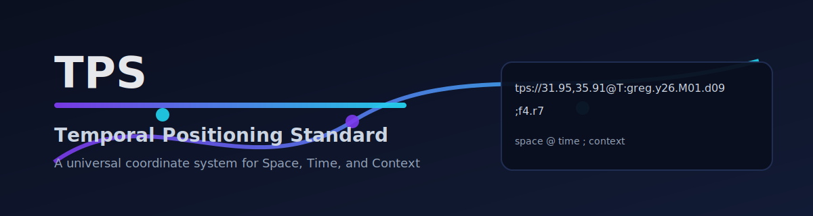

# TPS — Temporal Positioning Standard



A universal protocol for representing **time + location + context** in a single coordinate.

## Installation

```bash
npm i @nextera.one/tps-standard
```

## Quick Start

```ts
import {
  TPS,
  TpsDate,
  DefaultCalendars,
  TimeOrder,
  TPSUID7RB,
} from "@nextera.one/tps-standard";

// Current time in Gregorian
const now = TPS.now();
// "T:greg.m3.c1.y26.m3.d4.h06.m30.s00.m0"

// Convert a Date to TPS
const tpsTime = TPS.fromDate(
  new Date("2026-01-09T14:30:25Z"),
  DefaultCalendars.GREG,
);
// "T:greg.m3.c1.y26.m1.d9.h14.m30.s25.m0"

// Build a full TPS URI with coordinates
const uri = TPS.toURI({
  calendar: "greg",
  millennium: 3,
  century: 1,
  year: 26,
  month: 1,
  day: 9,
  hour: 14,
  minute: 30,
  second: 25,
  millisecond: 0,
  latitude: 31.95,
  longitude: 35.91,
  altitude: 800,
});
// "tps://L:31.95,35.91,800m@T:greg.m3.c1.y26.m1.d9.h14.m30.s25.m0"

// Parse back
const parsed = TPS.parse(uri);

// Generate reversible TPS UID (binary base64url)
const uid = TPSUID7RB.encodeBinaryB64(uri);
const decoded = TPSUID7RB.decodeBinaryB64(uid);
```

---

## Calendars

8 built-in calendar drivers are registered automatically:

| Code   | Calendar                     | Notes                                            |
| ------ | ---------------------------- | ------------------------------------------------ |
| `tps`  | TPS Native                   | Hierarchical millennium/century/year tokens      |
| `greg` | Gregorian                    | ISO proleptic calendar                           |
| `unix` | Unix Epoch                   | seconds since 1970-01-01T00:00:00Z               |
| `per`  | Persian (Jalali/Solar Hijri) | Solar calendar, used in Iran & Afghanistan       |
| `hij`  | Hijri (Islamic Tabular)      | Lunar calendar, 12 months × 29/30 days           |
| `jul`  | Julian                       | Historical proleptic; Gregorian is 13d ahead now |
| `holo` | Holocene (Human Era)         | Gregorian + 10,000                               |
| `chin` | Chinese Lunisolar            | Huangdi year numbering + Ganzhi cycle            |

### Examples

```ts
// Persian
TPS.fromDate(new Date(), "per"); // "T:per.y1404.m12.d14.h10.m0.s0"

// Hijri
TPS.fromDate(new Date(), "hij"); // "T:hij.y1447.m09.d04.h10.m0.s0"

// Chinese
TPS.fromDate(new Date(), "chin"); // "T:chin.m5.c5.y26.m1.d14.h10.m0.s0"
TPS.getDriver("chin")!.format(
  { millennium: 5, century: 5, year: 26, month: 1, day: 14 },
  "zh",
);
// "4726年正月14日"

// Julian
TPS.fromDate(new Date(), "jul"); // "T:jul.m3.c1.y26.m2.d19.h10.m0.s0"

// Holocene
TPS.fromDate(new Date(), "holo"); // "T:holo.m4.c3.y26.m3.d4.h10.m0.s0" (12026 HE)
```

Custom drivers can be registered via:

```ts
TPS.registerDriver(myDriver);
// or via the DriverManager:
TPS.driverManager.register(myDriver);
console.log(TPS.driverManager.list()); // ["tps","greg","unix","per","hij","jul","holo","chin",...]
```

---

## Time Format

Canonical token order is **descending hierarchy**:

```
T:greg.m3.c1.y26.m01.d13.h09.m30.s12.m0
```

| Token        | Meaning         |
| ------------ | --------------- |
| `m` (rank 8) | millennium      |
| `c`          | century         |
| `y`          | year in century |
| `m` (rank 5) | month           |
| `d`          | day             |
| `h`          | hour            |
| `m` (rank 2) | minute          |
| `s`          | second          |
| `m` (rank 0) | millisecond     |

Ascending order is supported via `TimeOrder.ASC` and auto-detected during parsing.

---

## URI Format

```
tps://[SPACE][/A:actor]@T:[calendar].[tokens][!signature][;extensions][?query][#fragment]
```

### Space Anchors

| Pattern                                | Meaning                               |
| -------------------------------------- | ------------------------------------- |
| `L:-`, `L:unknown`                     | Unknown / anonymous location          |
| `L:~`, `L:hidden`                      | Hidden location                       |
| `L:redacted`                           | Redacted location                     |
| `L:lat,lon[,alt]m`                     | GPS coordinates                       |
| `L:s2=...`                             | S2 Cell                               |
| `L:h3=...`                             | H3 Cell                               |
| `L:plus=...`                           | Plus Code                             |
| `L:w3w=...`                            | What3Words                            |
| `L:bldg=...`                           | Structural (building/floor/room/zone) |
| `adm:`, `node:`, `net:ip4:`, `planet:` | Generic pre-`@` anchors               |

### Timezone Extension

Add `;tz=` to have `TPS.toDate()` interpret the calendar components as local time:

```ts
// 14:30 in Tehran time → UTC 11:00
TPS.toDate("tps://unknown@T:greg.m3.c1.y26.m1.d9.h14.m30.s0.m0;tz=Asia/Tehran");
// or
TPS.toDate("T:greg.m3.c1.y26.m1.d9.h14.m30.s0.m0;tz=+03:30");
```

Supported: IANA names (`Asia/Tehran`), fixed offsets (`+03:30`, `-05:00`), and common abbreviations (`IRST`, `JST`, `EST`, …).

---

## Convenience Methods

```ts
// Current time
TPS.now(); // Gregorian by default
TPS.now("hij"); // Current time in Hijri

// Time difference
const ms = TPS.diff(
  "T:greg.m3.c1.y26.m1.d1.h0.m0.s0.m0",
  "T:greg.m3.c1.y26.m1.d2.h0.m0.s0.m0",
); // 86_400_000 (one day)

// Shift by duration
const t = "T:greg.m3.c1.y26.m1.d9.h14.m30.s25.m0";
TPS.add(t, { days: 7 }); // one week later
TPS.add(t, { hours: -2 }); // two hours earlier
TPS.add(t, { minutes: 90, seconds: 30 }); // +1h 30m 30s
```

---

## TpsDate

```ts
const td = new TpsDate("tps://unknown@T:greg.m3.c1.y26.m01.d09.h14.m30.s25.m0");

const gregorian = td.toGregorianDate(); // native JS Date clone
const asTps = td.toTPS(DefaultCalendars.TPS, { order: TimeOrder.DESC });
const uri = td.toTPSURI(DefaultCalendars.GREG, {
  latitude: 31.95,
  longitude: 35.91,
});
```

---

## TPSUID7RB (Reversible Binary ID)

```ts
const tps = "tps://node:api-1@T:greg.m3.c1.y26.m01.d09.h14.m30.s25.m0";
const id = TPSUID7RB.encodeBinaryB64(tps, { compress: true });
const out = TPSUID7RB.decodeBinaryB64(id);
// out.tps === tps
```

---

## Scripts

```bash
npm run build    # CJS + ESM TypeScript compilation
npm run bundle   # Browser IIFE bundle (dist/tps.min.js)
npm run tests    # Run all test suites
```

---

## License

Apache-2.0
